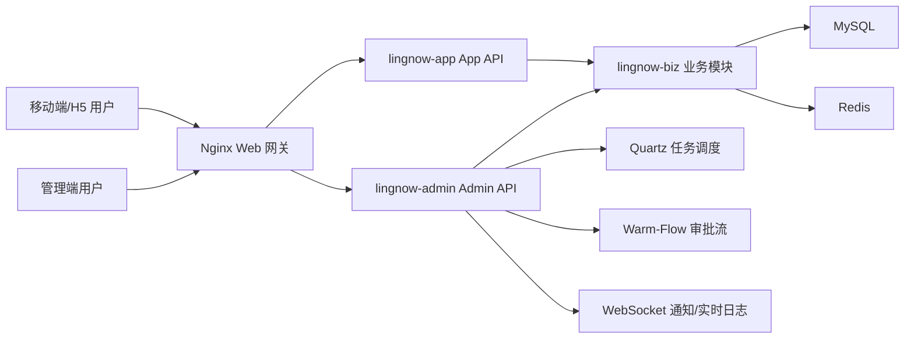

# 系统架构设计

## 总体架构



## 后端模块

- `lingnow-admin`：管理端 API、ERP 管理接口、审批、监控、任务、通知。
- `lingnow-app`：移动端/H5 API、App 鉴权、移动端 ERP 查询和地址识别。
- `lingnow-biz`：ERP 实体、Mapper、Service、公共业务能力。
- `lingnow-core`：核心基础设施。
- `lingnow-common`：通用模型、异常、工具、MyBatis-Plus、Redis 等。

## 前端模块

- `admin-ui`：管理端 Web。
- `uniapp`：移动端/H5。

## 数据库

默认数据库为：

```text
lingnow_erp
```

初始化脚本：

```text
backend/sql/init.sql
```

## 鉴权与权限

- 管理端使用 Admin token。
- App/H5 使用 App token。
- 菜单由后端 `sys_menu` 驱动。
- 按钮权限通过权限标识控制。
- 数据授权通过客户、仓库等业务维度隔离。

## 审批流

审批流使用 Warm-Flow 接入，Admin 服务内启动，不需要独立审批服务。

支持：

- 提交审批。
- 待我审批。
- 审批通过。
- 审批驳回。
- 审批撤回。
- 审批转交。
- 审批历史。

## 通知与语音提醒

- 通知数据复用系统通知表。
- 管理端通过 WebSocket 接收通知。
- 新销售单、审批待办、审批结果可产生通知。
- 语音提醒为浏览器本地配置，保存在当前浏览器本地存储。

## 任务与监控

- 任务监控基于 Quartz。
- 实时日志基于 WebSocket。
- 服务监控展示 Admin 服务、JVM、MySQL、Redis、Quartz 摘要。
- 缓存监控展示 Redis 指标。

