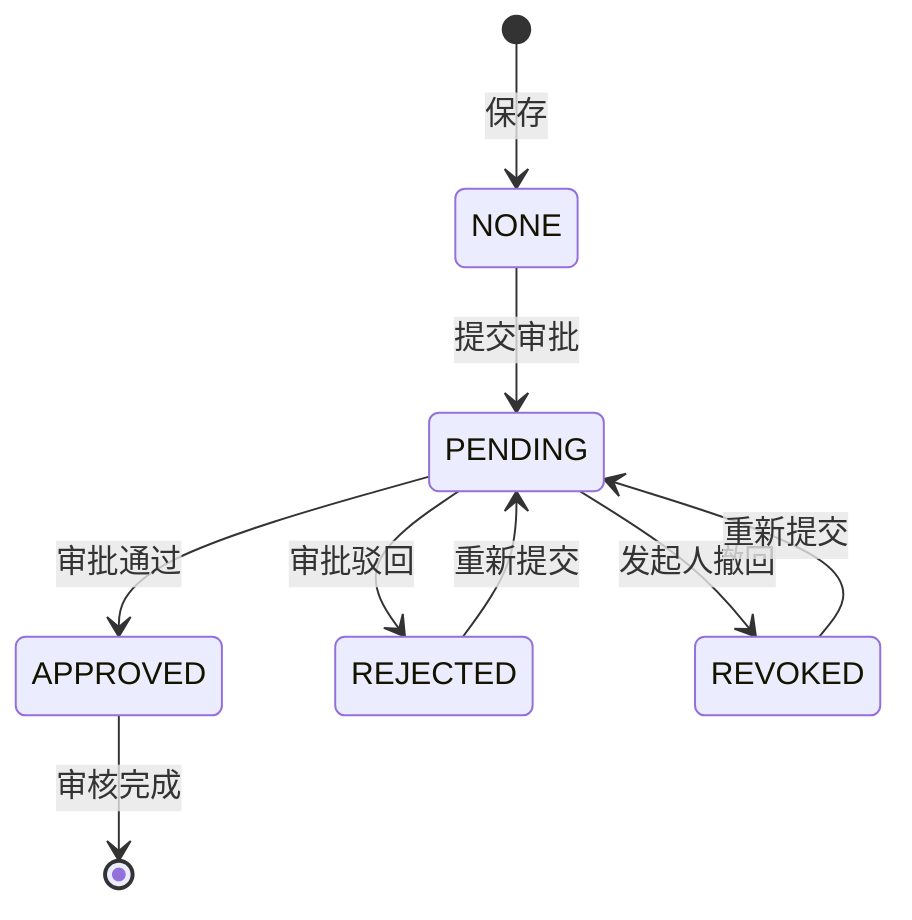

# 业务流程与状态机

## 单据状态

业务单据至少包含两类状态：

- 审核状态：未审核、已审核。
- 审批状态：未提交、审批中、已通过、已驳回、已撤回。

原则：

- 保存单据不直接影响库存和资金。
- 审批通过后完成审核，并触发库存、资金、往来流水。
- 反审核必须回滚库存、资金、往来影响。
- 已审核单据不得随意删除，需先反审核。

## 19 条发版验收流程

1. 基础资料：新增、编辑、查询、引用删除拦截。
2. 进货入库：保存不动库存，审批后库存增加，应付/资金流水正确。
3. 销售出库：审批后库存减少，应收/资金流水正确，新销售单通知正确。
4. 库存不足：超库存销售审批失败，库存和流水不变。
5. 销售退货：审批后库存增加，应收冲减，退款方向正确。
6. 进货退货：审批后库存减少，应付冲减，退款方向正确。
7. 收款单：审批生成资金/往来流水，反审核回滚。
8. 付款单：审批生成资金/往来流水，反审核回滚。
9. 库存盘点：盘盈/盘亏影响库存，负库存拦截，反审核回滚。
10. 审批综合：提交、正确审批人、无权审批失败、通过、驳回、撤回、转交、历史。
11. 商品导入导出：模板、导入、导出字段和数据校验。
12. 单据导出打印：销售/进货/退货导出和打印数据校验。
13. 报表：销售、进货、利润、库存、应收应付、账户余额与测试单据对账。
14. 系统配置：单号规则、字段设置、打印模板新增/修改/查询，并恢复配置。
15. 权限：角色、职员、菜单、按钮接口权限。
16. 数据授权：受限用户只能看到授权客户/仓库数据。
17. 通知中心：未读数、已读、全部已读、审批通知、新销售单通知、跳转地址。
18. 服务监控：服务、缓存、任务新增/启停/执行一次/日志。
19. 移动端/App：鉴权、首页/业务壳接口、地址识别接口。

## 审批链路

## 库存链路

- 进货单审批通过：库存增加。
- 销售单审批通过：库存减少。
- 销售退货审批通过：库存增加。
- 进货退货审批通过：库存减少。
- 库存盘点审批通过：库存调整为盘点数。

## 财务链路

- 销售单：形成客户应收。
- 销售退货：冲减客户应收。
- 进货单：形成供应商应付。
- 进货退货：冲减供应商应付。
- 收款单：账户收入，客户往来收款。
- 付款单：账户支出，供应商往来付款。

